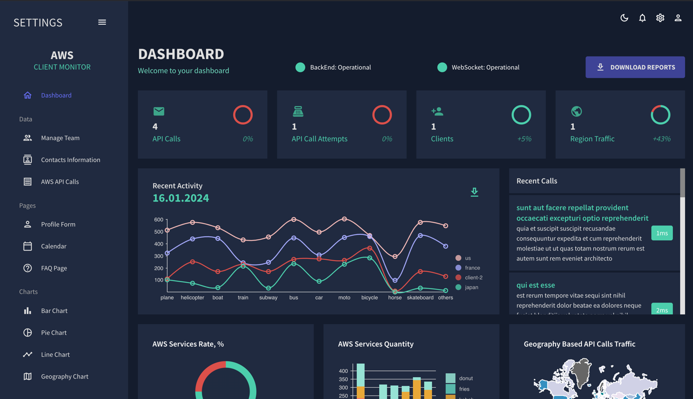

## AWS Client Monitor

AWS Client Monitor is a tool designed to analyze applications interacting with AWS services. It's particularly useful during local development, troubleshooting, or profiling third-party applications.

## Features
- Real-time Monitoring: Capture and display AWS API invocations from your applications in real-time.
- Easy Integration: Minimal setup required; configure environment variables, and you're ready to go.
- Dockerized Deployment: Run the monitor effortlessly using Docker.

## Prerequisites
Docker: Ensure Docker is installed on your system.


## Setup Instructions

1. Configure Your Application: Set the following environment variables in each application you wish to monitor:

```shell
export AWS_CSM_ENABLED=true 
export AWS_CSM_CLIENT_ID=my-app-service-name
```

Optional:

```shell
export AWS_CSM_HOST=127.0.0.1
export AWS_CSM_PORT=31000
```

2. Start AWS Client Monitor: Run the monitor using Docker:

```shell
 docker run -p 8080:8080 -p 31000:31000/udp rtsypuk/aws-client-monitor:development
```

3. After that any apps will automatically send information about invocation of AWS API to the ``aws-client-monitor``:

```shell
2024-12-22 16:35:23 UTC [Client:cli-session(aws-cli/1.27.92 md/Botoco) ==========> AWS:S3:ListBuckets(s3.eu-west-1.amazonaws.com)] : 205ms eu-west-1 Code:400
2024-12-22 16:35:23 UTC [Client:cli-session(aws-cli/1.27.92 md/Botoco) ==========> AWS:S3:ListBuckets] : 208ms eu-west-1 Code:400
2024-12-22 16:35:27 UTC [Client:cli-session(aws-cli/1.27.92 md/Botoco) ==========> AWS:Lambda:ListFunctions(lambda.eu-west-1.amazonaws.com)] : 222ms eu-west-1 Code:403
2024-12-22 16:35:27 UTC [Client:cli-session(aws-cli/1.27.92 md/Botoco) ==========> AWS:Lambda:ListFunctions] : 226ms eu-west-1 Code:403
2024-12-22 16:35:23 UTC [Client:user-service(aws-cli/1.27.92 md/Botoco) ==========> AWS:S3:ListBuckets(s3.eu-west-1.amazonaws.com)] : 205ms eu-west-1 Code:400
2024-12-22 16:35:23 UTC [Client:user-service(aws-cli/1.27.92 md/Botoco) ==========> AWS:S3:ListBuckets] : 208ms eu-west-1 Code:400
2024-12-22 16:35:27 UTC [Client:subscirption-service(aws-cli/1.27.92 md/Botoco) ==========> AWS:Lambda:ListFunctions(lambda.eu-west-1.amazonaws.com)] : 222ms eu-west-1 Code:403
2024-12-22 16:35:27 UTC [Client:subscirption-service(aws-cli/1.27.92 md/Botoco) ==========> AWS:Lambda:ListFunctions] : 226ms eu-west-1 Code:403

```
4. Access the Dashboard: Open your browser and navigate to http://localhost:8080 to view the monitoring dashboard. 



## How It Works

Once your applications are configured and the monitor is running, any AWS SDK calls made by your applications will be captured and displayed in the AWS Client Monitor dashboard. This provides visibility into the AWS API interactions of your applications, aiding in development and troubleshooting.

## Contributing

Contributions are welcome! Feel free to open issues or submit pull requests to enhance the functionality of AWS Client Monitor.

## License

This project is licensed under the MIT License. See the LICENSE file for details.

## Note: 

This project is not affiliated with AWS. Use it responsibly and ensure it complies with your organization's security policies.